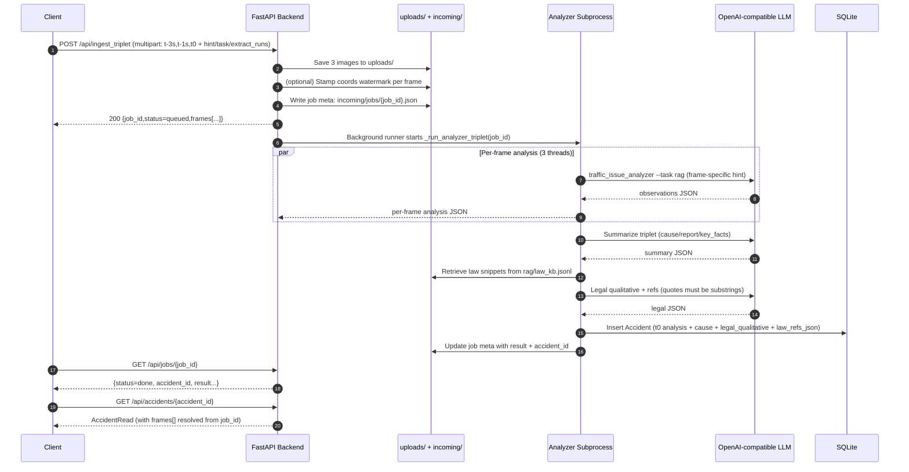

# smart_trans 技术复盘：架构与接口说明（含端到端 Demo）

面向读者：同业技术人员  
范围声明：只讲架构与接口；不贴实现代码；不输出任何密钥/内网域名/客户信息。

## 1. 需求背景与技术亮点

### 真实需求抽象

在smart_trans智能交通系统中，我们需要把摄像头抓拍到的交通事故图片快速转成“可入库、可统计、可回溯”的事故记录，并且支撑：

- 事故类型/严重程度的稳定输出（避免模型随机波动影响统计口径）
- 位置字段的可用性（EXIF 不可靠、视觉推断不稳定时仍能落到地图上）
- 异步处理与可追踪（长耗时多模态分析不能阻塞上传）
- 端到端闭环：入库 -> 统计 -> 前端大屏/列表/详情查看
- 外设报警（蜂鸣器 best-effort）

### 技术亮点（从源码结构提炼）

1) “确定性分类 + 可追溯”RAG

`traffic_issue_analyzer.py` 的 `--task rag` 采用两段式：

- 多模态 LLM 只负责“可见事实抽取”（结构化 observations）
- 最终 `accident_type/severity/confidence` 由本地规则 `rag/rules.json` 决策（稳定、可控）

同时把命中规则、检索片段、抽取输出摘要写入 `raw_model_output`，便于复盘。

2) Job 化异步入库

后端 `POST /api/ingest_triplet` 采用“上传即返回 job_id”的方式，后台线程/子进程完成分析与入库；并把日志与中间产物落盘到 `incoming/`，可定位失败原因。

3) 位置兜底策略（面向大屏体验）

后端 ingest 在保存图片后可对图片“打坐标水印”（确定性生成经纬度并写在右上角），并在模型/EXIF 坐标缺失时兜底填充，保证地图可用。

4) 多帧（triplet）事件级汇总 + 法规检索

`POST /api/ingest_triplet` 支持 t-3s/t-1s/t0 三帧并行分析，再做事件级“原因/报告/要点”归纳，最后基于本地法规 KB 做片段检索并输出定性与引用（引用必须来自检索片段，避免编造条文）。

## 2. 整体架构（模块与职责）

项目根目录关键组件：

- 分析器：`traffic_issue_analyzer.py`
  - 帧级分析；支持 `accident`（模型直出 JSON）与 `rag`（规则确定性 + trace）
  - 支持结果缓存 `.cache/smart_trans/accident_rag/`
- 端到端流水线：`pipeline_rag.py`
  - 调用分析器 -> 可选上传与入库 -> 可选蜂鸣器
- 后端：`backend/`（FastAPI + SQLite）
  - API：上传、事故记录、统计、ingest job
  - 静态托管：可把前端 build 到 `backend/static/` 单端口部署
- 前端：`frontend/`（React + Vite）
  - 页面：仪表盘、列表、详情
  - 可视化：ECharts + 地图（高德 JSAPI）
- 脚本上报：`pipeline_rag.py` + `send_triplet_http.py`
  - 通过 HTTP multipart 直接提交三帧到 `/api/ingest_triplet`
- 外设报警：`beep_mcp_server.py` + `llm_mcp_client.py`
  - MCP SSE：提供 `set_beep(state)` 工具；pipeline 或后端 ingest 可触发蜂鸣器（best-effort）

## 3. 端到端数据流（HTTP ingest_triplet 主链路）

这里选择 `/api/ingest_triplet` 作为主 Demo：它覆盖上传、异步 job、并行分析、事件汇总、法规检索、入库、前端查询的完整闭环。

### 3.1 时序图（概念级）



### 3.2 数据落点（可观测性）

- 上传文件：`backend/uploads/`
- Job 元数据：`incoming/jobs/<job_id>.json`
- Job 过程日志：
  - 单帧：`incoming/job_artifacts/<job_id>/frames/<key>/analyzer.stdout.txt` 等
  - 汇总/法律：`incoming/job_artifacts/<job_id>/summary.*.txt`、`law.*.txt`
- SQLite：默认 `backend/data/accidents.db`

## 4. 核心设计：确定性 RAG（规则即口径）

### 4.1 为什么不让模型直接给最终分类

事故类型/严重程度是统计口径，一旦模型“同图不同判”，报表会抖动，复盘也难对齐。因此本项目把 LLM 的作用限定为“事实抽取”，并把最终分类交给本地规则：

- 规则文件：`rag/rules.json`
  - `accident_type.rules[]` 按 `priority` 匹配 `when` 条件，输出 `set`
  - `severity.rules[]` 同理
  - `confidence` 由 base + weights 计算，并对“非事故/类型不清”等场景做保守上限
- 知识文件：`rag/knowledge.md`
  - 仅用于 trace 解释（检索片段不决定最终分类）

### 4.2 trace（raw_model_output）里包含什么

`raw_model_output`（字符串）用于可追溯，典型包含：

- extractor 版本、规则版本、抽取 runs 数
- 归一化 observations（事实抽取聚合结果）
- 命中规则（id/note）
- 检索到的知识片段摘要（top_k）
- 部分原始抽取输出摘要（截断以控体积）

并且：

- 后端 schema 限制 `raw_model_output` 最大长度（避免 DB 膨胀）
- pipeline 会按需裁剪 trace 体积，避免超过后端 schema 上限

## 5. 接口说明（Backend HTTP API）

后端统一前缀：`/api`  
返回格式：JSON（除上传为 multipart）

### 5.1 上传图片

POST `/api/uploads`

- Content-Type: `multipart/form-data`
- 入参：`file` (UploadFile)
- 出参（`UploadResponse`）：
  - `image_path`: `uploads/<filename>`
  - `image_url`: `/uploads/<filename>`
  - `exif`（可选）：若解析到 GPS，则含 `lat/lng/location_source/location_confidence`

示例响应（示意）：

```json
{
  "image_path": "uploads/9f0c...c2.jpg",
  "image_url": "/uploads/9f0c...c2.jpg",
  "exif": {"lat": 30.123456, "lng": 120.123456, "location_confidence": 1.0, "location_source": "exif"}
}
```

### 5.2 写入事故记录（同步写库）

POST `/api/accidents`

- Content-Type: `application/json`
- 入参（`AccidentCreate`，关键字段）：
  - `has_accident` (bool)
  - `accident_type` (string)
  - `severity` (string，后端会规范化到 `轻微/中等/严重`)
  - `description` (string)
  - `confidence` (0~1)
  - 可选：`source/image_path/hint/location_* / raw_model_output`
  - 可选（triplet 扩展）：`cause/legal_qualitative/law_refs`
- 出参：`AccidentRead`

### 5.3 查询事故记录

GET `/api/accidents`（分页 + 过滤）

- Query：
  - `page` (>=1), `page_size` (1~100)
  - 可选：`has_accident`、`severity`、`type`、`start`、`end`
- 出参：

```json
{"items": [], "total": 0, "page": 1, "page_size": 20}
```

GET `/api/accidents/{id}`（详情）

- 出参：`AccidentRead`
- 备注：详情会返回 `frames[]`
  - 若 `raw_model_output` 内含 `triplet_job_id=<job_id>`，后端会从 `incoming/jobs/<job_id>.json` 解析出三帧图片 URL
  - 否则 fallback 为单帧 `t0`

### 5.4 统计接口（仪表盘）

- GET `/api/stats/summary`：`total/last_7d/severe/severe_ratio`
- GET `/api/stats/by_type`：按 `accident_type` 计数
- GET `/api/stats/by_severity`：按 `轻微/中等/严重` 固定顺序计数
- GET `/api/stats/timeline?days=30`：近 N 天按日
- GET `/api/stats/geo?precision=2&limit=300`：lat/lng round 分桶（用于地图圈层）

### 5.5 异步 ingest：三帧（事件级）

POST `/api/ingest_triplet`

- Content-Type: `multipart/form-data`
- 入参（必须三帧）：
  - `frame_t3`：t-3s
  - `frame_t1`：t-1s
  - `frame_t0`：t0
  - `hint/task/extract_runs`：可选，默认 `task=rag`、`extract_runs=3`
- 出参（立即返回 job + frames）：

```json
{
  "job_id": "(32hex)",
  "status": "queued",
  "created_at": "YYYY-MM-DDTHH:MM:SS",
  "frames": [
    {"key": "t-3s", "image_path": "uploads/...jpg", "image_url": "/uploads/...jpg"},
    {"key": "t-1s", "image_path": "uploads/...jpg", "image_url": "/uploads/...jpg"},
    {"key": "t0", "image_path": "uploads/...jpg", "image_url": "/uploads/...jpg"}
  ]
}
```

后台行为要点：

- 三帧并行跑 analyzer（线程池），且为每帧注入不同的 frame-context hint（引导 t-3s/t-1s 描述“事故前态势”）
- 事件级汇总：输出 `cause/report/key_facts`
- 法规检索（本地 KB）+ 定性输出：
  - 检索库默认 `rag/law_kb.jsonl`（可通过环境变量覆盖路径）
  - 引用校验：`quote` 必须是检索片段子串，不满足会自动调整（或 fallback）
- 入库：以 t0 帧为主写 `Accident`，并把 `triplet_job_id` 写进 `raw_model_output`（供详情页回溯三帧）

### 5.6 Job 查询

- GET `/api/jobs/{job_id}`
- GET `/api/jobs?limit=50`

返回结构：

- `ok`: bool
- `job`: job 元数据（含 `status/result/error/accident_id/...`）

## 6. 端到端 Demo（步骤 + 示例请求/响应 + 数据流说明）

目标：上传三帧 -> 异步分析 -> 入库 -> 前端可查（列表/详情/地图/统计）。

说明：示例使用 `localhost` 表达；不包含任何真实密钥。响应字段与仓库 schema 对齐，但具体值会随图片不同而变化。

### Step 0：准备三帧文件

假设你已经有：

- `t-3s.jpg`
- `t-1s.jpg`
- `t0.jpg`

### Step 1：调用 triplet ingest

请求（multipart）：

```bash
curl -sS -X POST "http://localhost:28000/api/ingest_triplet" \
  -F "frame_t3=@t-3s.jpg" \
  -F "frame_t1=@t-1s.jpg" \
  -F "frame_t0=@t0.jpg" \
  -F "task=rag" \
  -F "extract_runs=3" \
  -F "hint=固定机位路口抓拍，疑似变道冲突"
```

响应（立即返回 job）示例：

```json
{
  "job_id": "7f1e2d3c4b5a6f...(32hex)",
  "status": "queued",
  "created_at": "2026-02-11T10:24:33",
  "frames": [
    {"key": "t-3s", "image_path": "uploads/a1...jpg", "image_url": "/uploads/a1...jpg"},
    {"key": "t-1s", "image_path": "uploads/b2...jpg", "image_url": "/uploads/b2...jpg"},
    {"key": "t0", "image_path": "uploads/c3...jpg", "image_url": "/uploads/c3...jpg"}
  ]
}
```

### Step 2：轮询 job 状态

请求：

```bash
curl -sS "http://localhost:28000/api/jobs/7f1e2d3c4b5a6f...(job_id)"
```

完成态（done）示例（只截取关键字段）：

```json
{
  "ok": true,
  "job": {
    "id": "7f1e...",
    "status": "done",
    "finished_at": "2026-02-11T10:24:58",
    "accident_id": 42,
    "result": {
      "mode": "triplet",
      "task": "rag",
      "frames": [
        {"key": "t-3s", "ok": true, "analysis": {"has_accident": false, "accident_type": "其他", "severity": "轻微"}},
        {"key": "t-1s", "ok": true, "analysis": {"has_accident": false, "accident_type": "占道", "severity": "轻微"}},
        {"key": "t0", "ok": true, "analysis": {"has_accident": true, "accident_type": "侧面碰撞", "severity": "中等"}}
      ],
      "cause": "（示例）疑似变道/交汇未让行导致侧向碰撞，需结合视频确认。",
      "legal_qualitative": "（示例）可能涉及变更车道影响正常通行、未按规定让行等情形（仅供参考）。",
      "law_refs": [
        {"snippet_id": "abc123...", "source": "某法规文件", "title": "第X条", "quote": "……", "relevance": "与变更车道/让行义务相关"}
      ]
    }
  }
}
```

失败态（failed）时，建议直接查看落盘日志：

- `incoming/job_artifacts/<job_id>/...`

### Step 3：读取已入库事故详情

请求：

```bash
curl -sS "http://localhost:28000/api/accidents/42"
```

响应（`AccidentRead`）示例（关键字段）：

```json
{
  "id": 42,
  "created_at": "2026-02-11T10:24:58+08:00",
  "source": "http_ingest_triplet",
  "has_accident": true,
  "accident_type": "侧面碰撞",
  "severity": "中等",
  "confidence": 0.78,
  "description": "（示例）基于可见事实的描述……",
  "image_url": "/uploads/c3...jpg",
  "lat": 30.2,
  "lng": 120.1,
  "location_source": "watermark",
  "cause": "（示例）疑似变道/交汇未让行……",
  "legal_qualitative": "（示例）可能涉及……",
  "law_refs": [],
  "frames": [
    {"key": "t0", "image_url": "/uploads/c3...jpg"},
    {"key": "t-1s", "image_url": "/uploads/b2...jpg"},
    {"key": "t-3s", "image_url": "/uploads/a1...jpg"}
  ]
}
```

### Step 4：前端侧如何消费这些接口（闭环验证点）

- 仪表盘页面并发拉取：
  - `/api/stats/summary`
  - `/api/stats/by_type`
  - `/api/stats/by_severity`
  - `/api/stats/timeline?days=30`
  - `/api/stats/geo?precision=2&limit=300`
- 列表页：
  - `/api/accidents?page=1&page_size=20&severity=...&has_accident=...`
- 详情页：
  - `/api/accidents/{id}`（展示 frames、原因、法规引用、地图点）

## 7. MCP（SSE）接口补充：局域网“收图即跑 pipeline”

如果需求是“手机/摄像头在局域网内把图片发到一台接收机，接收机自动跑 pipeline 并落盘 job”，则走 MCP。

### 7.1 接收端（MCP Server）

三帧上报建议直接使用 HTTP：

- `POST /api/ingest_triplet`（multipart）
- `GET /api/jobs/{job_id}` / `GET /api/jobs?limit=...`

安全控制点（接收端可强制治理）：

- `SMART_TRANS_PIPELINE_DISABLE_BEEP`：剥离所有 beep 参数
- `SMART_TRANS_PIPELINE_DEFAULT_CLI`：默认透传参数（JSON list 或空格分隔）

### 7.2 与 HTTP ingest 的差异

- MCP job 的执行体是 `pipeline_rag.py`（提交 triplet 到 ingest_triplet，并可轮询完成）
- HTTP ingest 的执行体是 `traffic_issue_analyzer.py`（更轻、更聚焦于分析与入库）

## 8. 配置与部署口径（不含任何密钥）

### 8.1 LLM（必需）

采用 OpenAI-compatible 客户端；通过环境变量提供：

- `SILICONFLOW_API_KEY`（或等价 API key）
- `SILICONFLOW_BASE_URL`
- `SILICONFLOW_MODEL`

### 8.2 后端（可选）

- `SMART_TRANS_DB`：SQLite 路径（默认在 `backend/data/`）
- `SMART_TRANS_UPLOADS`：上传目录（默认 `backend/uploads/`）
- `SMART_TRANS_CORS_ORIGIN`：前端来源（默认 `http://localhost:25173`）

### 8.3 前端地图（可选但影响地图展示）

- `VITE_AMAP_KEY`（构建时注入）
- `VITE_AMAP_SECURITY_CODE`（可选）
- `VITE_AMAP_COORD_MODE=gps|gcj`：默认 gps；gps 会在前端调用 Convertor 转 gcj（避免坐标系偏移）

### 8.4 单端口部署

- `frontend` build 输出到 `backend/static/`
- `backend/app/main.py` 会在检测到 `static/index.html` 后启用 SPA fallback，并挂载 `/assets`

## 9. 复盘：约束、风险与改进方向（架构层面）

1) 依赖分层

`pipeline_rag.py` 当前重点应放在分析链路稳定性与参数治理。

2) MCP/ingest 的安全与资源治理

MCP receiver 与 HTTP ingest 都有“写盘 + 触发本地执行”的天然风险：应考虑鉴权、限流、文件大小限制、磁盘配额与清理策略；并对可透传的 CLI 参数做更严格白名单。

3) 异步执行模型

当前采用“线程 + subprocess”的 best-effort 方式，优点是实现简单、隔离性好；缺点是吞吐与调度能力有限。若规模化，建议引入常驻 worker + 队列（Redis/SQLite job 表）并做幂等与重试策略。

4) 敏感配置治理（必须改进）

蜂鸣器 MCP server 属于外部平台集成，所有凭据必须只从环境变量读取；严禁在仓库中提供任何可用默认值（即便是测试值），并应在启动时做显式校验与脱敏日志。

5) 位置数据质量

目前位置来源存在优先级与兜底（watermark/exif/model/hint），后续可引入冲突合并策略（来源可信度、时间一致性、空间合理性），并增加逆地理编码以提升统计维度（行政区/道路）。

## 10. 附：接口速查表（便于联调）

- `POST /api/uploads`：上传图片（返回 `image_path/image_url/exif?`）
- `POST /api/accidents`：写事故记录（同步入库）
- `GET /api/accidents`：分页列表（支持过滤）
- `GET /api/accidents/{id}`：详情（含 frames/cause/legal refs）
- `GET /api/stats/summary|by_type|by_severity|timeline|geo`：仪表盘统计
- `POST /api/ingest_triplet`：三帧事件级异步分析入库（返回 job_id + frames）
- `GET /api/jobs` / `GET /api/jobs/{job_id}`：查询 ingest job
